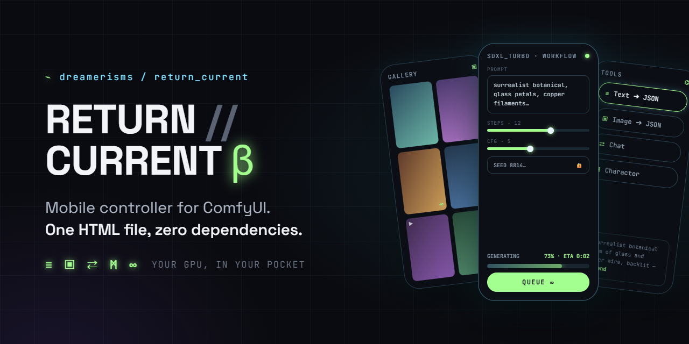

# RETURN // CURRENT <sup>β</sup>



**Mobile controller for ComfyUI. One HTML file, zero dependencies.**

Your GPU, in your pocket.

**[Try it →](https://dreamerisms.github.io/return_current/return_current_beta.html)** · **[Case study →](https://dreamerisms.github.io/return_current/)**

---

## Changelog

### β3.2.1 — July 25, 2026
- **Chat stopped writing ad copy.** The chat system prompt now bans markdown, headers, bold, blockquotes, section breaks, em dashes, rhetorical questions and closing taglines outright, keeps replies short, and when you ask it to alter a prompt it returns the prompt alone and changes only what you asked
- **Rendered prompts are model-shaped.** "Show me" prompts now open with the shot type and camera angle and cap at 150 words of concrete, drawable detail, so fewer tokens are wasted on language image models ignore
- **Text tool converts both ways** — a JSON / Natural Language toggle sits under the prompt box and the button reads Generate Prompt. Paste JSON and get prose, paste prose and get JSON, in either direction
- **⇤ Send to Freeform** in the Character tool, the mirror of Load into Sheet, so a character moves between the 18 fields and a plain text box freely

### β3.2 — July 25, 2026
- **Hidden prompts are found now.** Workflows that route their prompt through a primitive string node (so the encoder's text box is an input socket, not a widget) used to show no prompt field at all. The app now reads the prompt wherever it actually lives, and works out positive vs negative by following the graph instead of guessing from names
- **GetNode / SetNode support** — workflows wired with KJNodes' named-wire nodes now import correctly, links resolved back to their real sources. Re-import any workflow that used them
- **ᚲ Copy / ᛈ Paste Parameters** — carry sampler, scheduler, steps, CFG, denoise, text encoders, VAE, aspect ratio, megapixels, model and both seeds from one workflow to another, leaving the prompt and LoRAs alone. Values the target can't use are skipped and counted rather than forced
- **The status line moved up and lit up.** It now sits at the top of the Tools pane and sticks there, glowing in your theme and pulsing while the model works, settling when it's done. The elapsed timer is untouched
- **New example workflow: LTX-2 video** with audio, image-to-video, and the spatial upscaler chain

### β3.1 — July 18, 2026
- **Pinned characters are personas now.** Pin ᛗ in Chat and you're talking TO that character: first person, in their voice, fully uncensored, over your local model. The persona instructions are visible and editable right in the pane. "Show me" renders whatever they just described, and "you" means them
- **"Show me" is grounded in the moment** — the image prompt is written from the character's latest message plus your request, not a long transcript, so what renders is what was just said
- **ᚲ Copy / ᛈ Paste LoRA combos** — copy a whole LoRA stack with weights and toggles from one workflow and paste it into any other. Trigger words follow automatically
- **⇅ Import / Export** for Styles and Characters — a plain JSON array any LLM can write for you. Entries merge by name
- **Filterable libraries** — past 8 saved entries, a filter box appears; on desktop the lists go two columns
- Elaborate/Extract moved between Copy-as and Save in the Style tool; Recent Prompts now highlights your selection

### β3.0 — July 16, 2026
- **Two new themes.** ⚜ **Aurum** — obsidian glass with molten metallic gold: the progress bar, rails, and active elements run an animated bright-core gradient that reads as polished metal, never flat. Legendary-tier. 📼 **Trapper** — 1990s fluorescent: translucent chartreuse current with hot-orange flashes on deep trapper-keeper blue
- **The viewer wraps.** Panning past the last image lands on the first, mouse, keys, or swipe — no more dead ends. Repeat now only governs auto-advance
- **Image tool speaks Natural Language** — output pill alongside JSON, same as the other tools
- **Roomier prompts** — every prompt box grew ~25% and all of them are drag-stretchable now, chat box included

### β2.9.4 — July 15, 2026
- **Keyboard navigation inside the image viewer actually works now** — A/D and the arrow keys pan through stacks and single images alike. The navigation function was scoped where the keyboard handler could never reach it, so keys silently did nothing while the on-screen arrows worked fine

### β2.9.3 — July 15, 2026
- **Gallery misses actually fixed at the root.** A finished render whose history wrote slowly (video runs especially) was being permanently locked out of the gallery by an overeager duplicate-guard — which is why the watchdog seemed to make things worse. Completion is now only marked done after images are actually collected, so the fast path and the watchdog can both retry until it lands
- Lightbox keyboard navigation now works in every stack viewer regardless of how it was opened

### β2.9.2 — July 15, 2026
- **The ghost of Gemma is exorcised.** If no LM Studio model was configured in *this* browser (settings are per-browser, so a fresh device or tester always starts empty), the app silently fell back to a hardcoded model that may not exist on your machine — producing a Python traceback from the node. There is no silent fallback anymore: every LLM feature checks first and tells you exactly what to do — "open ⚙ → LM Studio and tap ⌁ Find"

### β2.9.1 — July 15, 2026
- **The gallery can no longer miss a finished render.** Completion used to depend on catching a single WebSocket message; if it was dropped, the image sat on the server until you refreshed. A watchdog now polls active jobs directly, so every generation lands in the gallery without ever refreshing — and without resetting whatever you were doing in the other panes
- **Desktop lightbox navigation** — mouse clicks use the same edge zones as touch, hover reveals ‹ › arrows at the edges (bare glyphs, invisible on touch devices), and A/D and the arrow keys were already live

### β2.9 — July 14, 2026
- **∞ on every rendered bubble** — re-run the exact crafted prompt with a fresh seed, straight to the queue, no LLM round-trip. Seed-rolling a look you like is now one tap. A **Prompt** button beside it copies what the model actually wrote
- **Pinned ᛗ Character and ᛋ Style** — pin a saved character and style to the conversation and every "show me" honours them automatically. Standing art direction: Marla stays Marla, the style never drifts, and you never repeat yourself. Unpin with a tap
- **Sessions** — save a conversation (messages, render workflow, and pins together) and pick it back up later. Auto-named from your first message, update-in-place, tap to load, ✕ to delete

### β2.8 — July 14, 2026
- **Fixed: your uploaded image being ignored.** If an image upload failed mid-flight (the classic case: picking a photo while your phone's connection was still waking up), the app would silently render the workflow's original example image. Uploads now always attempt regardless of connection state, fail loudly, and Generate refuses to run until your chosen image has actually reached the server
- **VAE and Text Encoder pickers** — VAELoader and CLIP loader fields (single, dual, and triple) now open the folder-tree picker like every other model list. No more native dropdowns for encoder swaps
- **ᛗ Character is now a full studio.** Named character library with edit-in-place, exactly like Styles. Two input modes: **▦ Sheet** (the 18 fields, image extraction, JSON/Natural output, as before) and **≋ Freeform** (one box that takes natural language or pasted JSON). "Load into Sheet" converts either into the fields: JSON instantly, prose via the LLM. Save from either mode; tapping a saved character routes it to the right mode automatically

### β2.7 — July 14, 2026
- **ᛗ / ᛋ injection in Chat** — the same Character and Style pickers from the workflow editor now sit above the chat box. Drop a saved character or style into your message at the cursor, then "show me…" renders it

### β2.6 — July 14, 2026
- **⇄ Chat renders images now.** Pick a render workflow at the bottom of the Chat pane, then just talk. Say "show me…", "draw…", "generate…", or "make me a picture of…" and the model writes an image prompt from your conversation, pushes it through your chosen workflow (your enabled LoRA keywords prepended automatically, fresh seed every time), and the finished image lands in the conversation as its own bubble. Tap it to open the lightbox. Keep talking, keep iterating — "same scene but at dawn" just works, because the prompt is written from the whole conversation
- Renders use the exact same queue, progress bar, and gallery as everything else — chat images are gallery images
- A failed render reports its reason right in the conversation
- **Aspect ratio and megapixels in the pane** — if your render workflow has a ResolutionSelector, its ratio picker and a compact MP field appear right under the workflow selector. Set 16:9 at 3.5MP once and every conversational render honours it; each workflow remembers its own
- Recent Prompts no longer renders under Chat; that space belongs to the render workflow now

### β2.5 — July 13, 2026
- **Shuffle and repeat** in the lightbox, sitting alongside auto-advance. Shuffle uses a proper bag: every image shows once before any repeats, so it never lands on the same photo twice in ten steps. Repeat joins the ends together, for auto-advance and for manual swipes alike. Both glow in your theme while active and remember their state

### β2.4 — July 13, 2026
- **▸ Auto-advance** — step through images hands-free in the lightbox. The glyph sits with the other controls and burns in your theme colour while it runs. Delay is configurable in settings
- **Vertical carousel** — the gallery gets the lightbox's progress bar stood on its end: the thumb sizes itself to how much is on screen and tracks as you scroll

### β2.3 — July 13, 2026
- **Desktop layout** — on a wide screen the fields stop sprawling and settle into a readable column, while the gallery spreads out to use the space
- **Gallery view modes** — ᛜ dense, ▣ comfortable, ▤ full size (one image per row at its true aspect ratio, no square crop). Switches instantly, remembers your choice
- **▸ Auto-advance** — step through images hands-free in the lightbox. The glyph sits with the other controls and burns in your theme colour while it runs. Delay is configurable in settings
- **Vertical carousel** — the gallery gets the lightbox's progress bar stood on its end: the thumb sizes itself to how much is on screen and tracks as you scroll
- **Edge taps are narrower** — the next/previous zones shrank from 30% to 18% per side, and navigation is now blocked outright while pinching or zoomed
- **Keyboard shortcuts** (desktop, undocumented on purpose): Enter sends in chat, Ctrl/Cmd+Enter generates, A/D or arrows move image to image (lightbox and gallery), W/S scroll the gallery, Space toggles auto-advance, 1–4 switch tabs, `/` jumps to the prompt, Esc closes anything

### β2.2 — July 13, 2026
- **Keep model loaded** — stops LM Studio unloading the model after every call. On a large model, reloading between requests costs far more than the actual inference. On by default
- **Response timing** — every chat reply shows how long it took, and the Tools status line reports the same
- **Configurable timeout** — default raised from 3 to 10 minutes, adjustable in settings

### β2.1 — July 13, 2026
- **Bring your own model** — the LLM behind the Tools suite is no longer hardcoded. Set any LM Studio model key in settings, or tap **⌁ Find** to pull the list straight from LM Studio and pick from it. Optional separate vision model if you run one
- **Thinking toggle** — for reasoning models. Off by default. Automatically forced off for image analysis, where thinking is far slower for little gain, and left to you for text tasks where it actually helps
- **Reasoning traces are stripped** from every output, so `<think>` blocks never leak into your prompts, styles, characters, or chat

### β2.0 — July 13, 2026
- **Errors reach your pocket** — when a generation fails, the app now shows you *why*, on your phone: the failing node, the exception, and the full traceback behind a toggle. One tap copies the whole thing for a bug report. No more walking to the PC to read a console
- **Rejected workflows name names** — validation failures list exactly which node and which input ComfyUI refused
- **Any model, any format** — model pickers list your safetensors and GGUF files together. Pick either one and the app swaps the loader node to match on submit, keeping every link in the graph intact
- Model dropdowns now read their options from the live server for the exact node in your workflow, so no loader variant can be handed the wrong list

### β1.8 — July 11, 2026
- **ᛗ / ᛋ prompt injection** — saved Characters and Styles drop into any prompt at your cursor with one tap. Pills sit above the prompt box; no LLM, no clipboard, no retyping
- **Folder-tree pickers** — every LoRA and model dropdown is replaced by a navigable directory browser with breadcrumbs and live search. It opens inside your current file's folder, so swapping is two taps instead of scrolling past your entire collection. No more native dropdowns anywhere
- Editor and settings labels now share the same typographic language

### β1.7 — July 10, 2026
- **ᛗ Character from image** — extract a subject from up to 4 reference images straight into the 18 character fields. The LLM ignores style completely and returns schema-locked JSON, so the character arrives pre-filled and immediately editable
- **Character round-trip** — tap any saved ᛗ entry to reload it into the creator, tweak a few fields, and generate a variant

### β1.6 — July 9, 2026
- **ᛋ Style tool** — build a style library out of plain text you own, not opaque reference codes. Write a style, elaborate it with the LLM, or **extract one from up to 4 images** (subject ignored entirely, style only). Name it, save it, edit it, copy it as natural language or JSON
- Editable extraction instructions for both Style and Character, persisted between sessions

### β1.5 — July 8, 2026
- **Consolidated outputs** — optional override sends every generation to `output/<your folder>/<model>/` with dated filenames, so app renders stop scattering across the paths baked into each workflow. Name the folder whatever you like, or switch it off to respect your workflows' own save paths

### β1.4 — July 7, 2026
- **Tools is now a suite** — four tools behind glyph pills: ≡ Text, ▣ Image, ⇄ Chat, ᛗ Character
- **⇄ Chat** — talk directly to the model running in LM Studio, from your phone. Full conversation memory, one image attachment per message, live elapsed indicator, and fail-fast errors that name what went wrong
- **ᛗ Character Creator** — an 18-field character builder. Fill only what matters; output as instant JSON (assembled locally, no LLM round-trip) or LLM-composed natural language. Characters save to Recent Prompts under ᛗ
- **Uncensored by design** — every built-in system prompt now defers entirely to your local model. The app adds zero content filtering of its own; what your model allows is between you and the model you chose to run
- **GGUF everywhere** — GGUF models now populate loader dropdowns correctly (plus a fix for ComfyUI's newer COMBO spec across all model lists)
- **Glyph design language** — emoji replaced with typographic marks throughout the tools: ≡ ▣ ⇄ ᛗ ⌬ ⌁, with ∞ remaining the glowing blend marker (Legendary theme gives blended history entries a holographic border)
- **Prompt provenance** — Recent Prompts entries are tagged by source: ≡ ▣ ᛗ LoRA ∞
- Fixed: Chat hanging forever on send; image tiles bleeding into the Chat and Character panes; GGUF dropdowns coming back empty

### β1.3 — July 6, 2026
- **LoRA info panel** — tap ⌬ on any LoRA to pull its CivitAI page: trigger words as tappable glowing bubbles (tap to add/remove from your keyword set), example images with full generation metadata (prompt, sampler, steps, CFG, seed, model)
- **One-tap prompt harvesting** — Copy button on any LoRA example prompt sends it to your clipboard *and* your Recent Prompts history
- **Recent Prompts source labels** — history entries now tagged *Text*, *Image*, or *LoRA* so you know where each prompt came from
- **Multi-image Image ➔ JSON** — add up to 4 images as thumbnail tiles; each is analyzed individually, then blended into one cohesive prompt
- **Multi-prompt Text ➔ JSON** — blend up to 4 separate concepts into a single scene
- **Editable blend instructions** — tune how the LLM fuses your images/prompts; your edits persist
- Version number moved to settings panel; header now carries a glowing β

### β1.2 — July 5, 2026
- **JSON workflow import** — both standard ComfyUI exports and API-format files, converted on import (handles bypassed nodes, Reroutes, dict-style widgets, and modern COMBO specs)
- **Stale-import detection** — workflows imported under an older converter warn you to re-import after fixes
- **Advanced section** — unrecognized custom nodes expose their editable parameters in a collapsed section instead of disappearing
- **Seed lock** 🔒 — freeze the seed for A/B comparisons across models, LoRAs, and prompt edits
- **Ideogram color palette** — chip-based hex color picker, up to 12 colors
- **LoRA trigger keywords** — per-LoRA persistent keyword memory with aggregate Copy bar
- **Editable LoRA strength** — type exact values beyond the slider range
- Ideogram 4 quality presets corrected to 12 / 20 / 28 steps
- VRAM cleanup runs silently on every video generation (no more allocator crashes on repeat runs)

### β1.0 — July 5, 2026
- Initial public release: workflow import from PNG, auto-detected editor fields with smart sorting, gallery with prompt grouping and video autoplay, lightbox with swipe/auto-pan, ∞ iterate, 7 glow themes, queue with live progress and ETA, Tools pane (Text ➔ JSON / Image ➔ JSON via LM Studio)

---

## What is this?

A single HTML file that turns your phone into a remote for your ComfyUI rig. Import any workflow, edit every meaningful field with a thumb-friendly UI, queue generations, and watch images and video land in a live gallery — from the couch, the yard, or anywhere your network reaches.

No app store. No install. No subscription. No cloud middleman. Your PC does the work.

## Quick Start

**Requirements:** ComfyUI on your PC, [Tailscale](https://tailscale.com/) on PC + phone (or same LAN), and for full features: [rgthree-comfy](https://github.com/rgthree/rgthree-comfy), [VHS](https://github.com/Kosinkadink/ComfyUI-VideoHelperSuite), and LM Studio nodes.

**1. Add two flags to your ComfyUI launch .bat:**

```
--listen 0.0.0.0 --enable-cors-header
```

`--listen` opens ComfyUI to your network. `--enable-cors-header` lets the app talk to ComfyUI's API from a different port. Restart ComfyUI.

**2. Serve the app from your PC.** Drop `return_current_beta.html` in a folder (rename to `index.html` for a clean URL). Create `serve.bat` next to it:

```
cd /d "%~dp0"
python -m http.server 8000
```

No system Python? Use ComfyUI portable's embedded one:

```
cd /d "%~dp0"
..\ComfyUI_windows_portable\python_embeded\python.exe -m http.server 8000
```

Double-click it. Leave it running.

**3. Get your IP.** Right-click the Tailscale tray icon — your IP is right there under your device name. LAN IP works too for home-only use.

**4. Open on your phone.** Browse to `http://YOUR-IP:8000`. Add to Home Screen for the full-screen app experience.

**5. Connect.** Tap ⚙ → enter your IP and ComfyUI's port (`8188`) → Save. Dot turns green.

## Example Workflows

The [`workflows/`](workflows/) folder has tested examples for **SDXL, Anima, Ideogram 4, Krea 2, Wan 2.2 video, and LTX-2 video** — all open cleanly in ComfyUI *and* import into the app. The four image workflows share a surrealist botanical prompt, and the Wan 2.2 workflow's default prompt animates their outputs: an end-to-end demo chain out of the box. Full prerequisite download tables in the folder README.

## Troubleshooting

**"Disconnected"** — Confirm ComfyUI is running with both flags above. Settings should point to ComfyUI's port (`8188`), not the app server (`8000`).

**Missing fields** — The workflow uses custom nodes the app doesn't recognize yet. They still generate with defaults; check the Advanced section.

**Editor error / import error** — The toast names the failing node. Open an [issue](../../issues) with the message and the workflow file; that's everything needed to add support.

**App looks stale after an update** — Hard-refresh (pull down / Ctrl+Shift+R). Browsers cache aggressively.

## Standing On Shoulders

Return Current is a thin layer over an enormous amount of other people's work. It connects things; these people built the things:

- **[comfyanonymous & Comfy Org](https://github.com/comfyanonymous/ComfyUI)** — ComfyUI itself, the engine this entire app exists to reach. None of this means anything without it.
- **[rgthree](https://github.com/rgthree/rgthree-comfy)** — the Power Lora Loader that anchors the app's LoRA system, and an info-panel concept this app's ⌬ button openly borrows from.
- **[Kosinkadink](https://github.com/Kosinkadink/ComfyUI-VideoHelperSuite)** — Video Helper Suite, the reason video output works at all.
- **[Fannovel16](https://github.com/Fannovel16/ComfyUI-Frame-Interpolation)** — frame interpolation that makes 16fps generations feel like film.
- **[city96](https://github.com/city96/ComfyUI-GGUF)** — GGUF loaders that let big video models fit on real people's GPUs.
- **[mattjohnpowell](https://github.com/mattjohnpowell/comfyui-lmstudio-image-to-text-node)** — the LM Studio bridge nodes behind the entire Tools pane.
- **[pythongosssss](https://github.com/pythongosssss/ComfyUI-Custom-Scripts)** — ShowText and a pile of quality-of-life nodes the ecosystem quietly runs on.
- **[CivitAI](https://civitai.com)** — the public API powering trigger word lookup and example galleries, and the community hosting the LoRAs themselves.
- **Every LoRA trainer and model creator** whose work passes through this app — the researchers and teams behind SDXL, Ideogram, Krea, Wan, and Gemma, and the individuals training and freely sharing the fine-tunes that make local generation interesting.
- **[Tailscale](https://tailscale.com)** — the plumbing that makes "from anywhere" true instead of marketing.
- **[Anthropic's Claude](https://claude.ai)** — this app was built in conversation with Claude, by a designer who doesn't write code. That sentence would have been science fiction recently. Credit where due, to the model and to everyone whose collective knowledge trained it.

If your work is in this list and you'd like something corrected, credited differently, or removed, open an issue and it's done.

## License

GPL-3.0 · free and open source · built by [dreamerisms](https://github.com/dreamerisms) in conversation with Claude

*If Return Current saves you trips to your desk, consider supporting development.*
