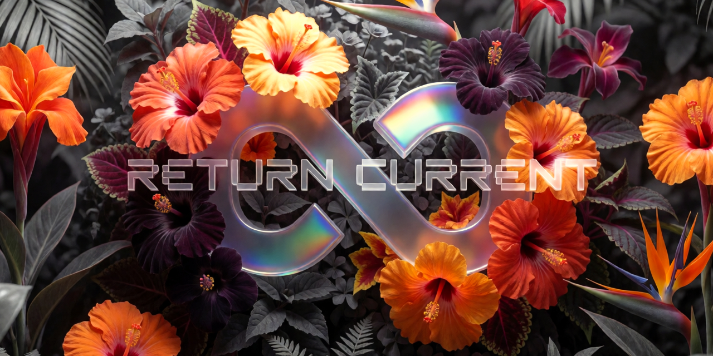

# RETURN // CURRENT <sup>β</sup>



**Mobile controller for ComfyUI. One HTML file, zero dependencies.**

Your GPU, in your pocket.

**[Try it →](https://dreamerisms.github.io/return_current/return_current_beta.html)** · **[Case study →](https://dreamerisms.github.io/return_current/)**

---

## Changelog

### β1.4 — July 7, 2026
- **Tools is now a suite** — four tools behind glyph pills: ≡ Text, ▣ Image, ⇄ Chat, ᛗ Character
- **⇄ Chat** — talk directly to the model running in LM Studio, from your phone. Full conversation memory, one image attachment per message, live elapsed indicator, and fail-fast errors that name what went wrong
- **ᛗ Character Creator** — an 18-field character builder. Fill only what matters; output as instant JSON (assembled locally, no LLM round-trip) or LLM-composed natural language. Characters save to Recent Prompts under ᛗ
- **Uncensored by design** — every built-in system prompt now defers entirely to your local model. The app adds zero content filtering of its own; what your model allows is between you and the model you chose to run
- **GGUF everywhere** — GGUF models now populate loader dropdowns correctly (plus a fix for ComfyUI's newer COMBO spec across all model lists)
- **Glyph design language** — emoji replaced with typographic marks throughout the tools: ≡ ▣ ⇄ ᛗ ⌬ ⌁, with ∞ remaining the glowing blend marker (Legendary theme gives blended history entries a holographic border)
- **Prompt provenance** — Recent Prompts entries are tagged by source: ≡ ▣ ᛗ LoRA ∞

### β1.3 — July 6, 2026
- **LoRA info panel** — tap 💡 on any LoRA to pull its CivitAI page: trigger words as tappable glowing bubbles (tap to add/remove from your keyword set), example images with full generation metadata (prompt, sampler, steps, CFG, seed, model)
- **One-tap prompt harvesting** — Copy button on any LoRA example prompt sends it to your clipboard *and* your Recent Prompts history
- **Recent Prompts source labels** — history entries now tagged *Text*, *Image*, or *LoRA* so you know where each prompt came from
- **Multi-image Image ➔ JSON** — add up to 4 images as thumbnail tiles; each is analyzed individually, then blended into one cohesive prompt
- **Multi-prompt Text ➔ JSON** — blend up to 4 separate concepts into a single scene
- **Editable blend instructions** — tune how the LLM fuses your images/prompts; your edits persist
- Version number moved to settings panel; header now carries a glowing β

### β1.2 — July 5, 2026
- **JSON workflow import** — both standard ComfyUI exports and API-format files, converted on import (handles bypassed nodes, Reroutes, dict-style widgets, and modern COMBO specs)
- **Stale-import detection** — workflows imported under an older converter warn you to re-import after fixes
- **Advanced section** — unrecognized custom nodes expose their editable parameters in a collapsed section instead of disappearing
- **Seed lock** 🔒 — freeze the seed for A/B comparisons across models, LoRAs, and prompt edits
- **Ideogram color palette** — chip-based hex color picker, up to 12 colors
- **LoRA trigger keywords** — per-LoRA persistent keyword memory with aggregate Copy bar
- **Editable LoRA strength** — type exact values beyond the slider range
- Ideogram 4 quality presets corrected to 12 / 20 / 28 steps
- VRAM cleanup runs silently on every video generation (no more allocator crashes on repeat runs)

### β1.0 — July 5, 2026
- Initial public release: workflow import from PNG, auto-detected editor fields with smart sorting, gallery with prompt grouping and video autoplay, lightbox with swipe/auto-pan, ∞ iterate, 7 glow themes, queue with live progress and ETA, Tools pane (Text ➔ JSON / Image ➔ JSON via LM Studio)

---

## What is this?

A single HTML file that turns your phone into a remote for your ComfyUI rig. Import any workflow, edit every meaningful field with a thumb-friendly UI, queue generations, and watch images and video land in a live gallery — from the couch, the yard, or anywhere your network reaches.

No app store. No install. No subscription. No cloud middleman. Your PC does the work.

## Quick Start

**Requirements:** ComfyUI on your PC, [Tailscale](https://tailscale.com/) on PC + phone (or same LAN), and for full features: [rgthree-comfy](https://github.com/rgthree/rgthree-comfy), [VHS](https://github.com/Kosinkadink/ComfyUI-VideoHelperSuite), and LM Studio nodes.

**1. Add two flags to your ComfyUI launch .bat:**

```
--listen 0.0.0.0 --enable-cors-header
```

`--listen` opens ComfyUI to your network. `--enable-cors-header` lets the app talk to ComfyUI's API from a different port. Restart ComfyUI.

**2. Serve the app from your PC.** Drop `return_current_beta.html` in a folder (rename to `index.html` for a clean URL). Create `serve.bat` next to it:

```
cd /d "%~dp0"
python -m http.server 8000
```

No system Python? Use ComfyUI portable's embedded one:

```
cd /d "%~dp0"
..\ComfyUI_windows_portable\python_embeded\python.exe -m http.server 8000
```

Double-click it. Leave it running.

**3. Get your IP.** Right-click the Tailscale tray icon — your IP is right there under your device name. LAN IP works too for home-only use.

**4. Open on your phone.** Browse to `http://YOUR-IP:8000`. Add to Home Screen for the full-screen app experience.

**5. Connect.** Tap ⚙ → enter your IP and ComfyUI's port (`8188`) → Save. Dot turns green.

## Example Workflows

The [`workflows/`](workflows/) folder has tested examples for **SDXL, Anima, Ideogram 4, Krea 2, and Wan 2.2 video** — all open cleanly in ComfyUI *and* import into the app. The four image workflows share a surrealist botanical prompt, and the Wan 2.2 workflow's default prompt animates their outputs: an end-to-end demo chain out of the box. Full prerequisite download tables in the folder README.

## Troubleshooting

**"Disconnected"** — Confirm ComfyUI is running with both flags above. Settings should point to ComfyUI's port (`8188`), not the app server (`8000`).

**Missing fields** — The workflow uses custom nodes the app doesn't recognize yet. They still generate with defaults; check the Advanced section.

**Editor error / import error** — The toast names the failing node. Open an [issue](../../issues) with the message and the workflow file; that's everything needed to add support.

**App looks stale after an update** — Hard-refresh (pull down / Ctrl+Shift+R). Browsers cache aggressively.

## Standing On Shoulders

Return Current is a thin layer over an enormous amount of other people's work. It connects things; these people built the things:

- **[comfyanonymous & Comfy Org](https://github.com/comfyanonymous/ComfyUI)** — ComfyUI itself, the engine this entire app exists to reach. None of this means anything without it.
- **[rgthree](https://github.com/rgthree/rgthree-comfy)** — the Power Lora Loader that anchors the app's LoRA system, and an info-panel concept this app's 💡 button openly borrows from.
- **[Kosinkadink](https://github.com/Kosinkadink/ComfyUI-VideoHelperSuite)** — Video Helper Suite, the reason video output works at all.
- **[Fannovel16](https://github.com/Fannovel16/ComfyUI-Frame-Interpolation)** — frame interpolation that makes 16fps generations feel like film.
- **[city96](https://github.com/city96/ComfyUI-GGUF)** — GGUF loaders that let big video models fit on real people's GPUs.
- **[mattjohnpowell](https://github.com/mattjohnpowell/comfyui-lmstudio-image-to-text-node)** — the LM Studio bridge nodes behind the entire Tools pane.
- **[pythongosssss](https://github.com/pythongosssss/ComfyUI-Custom-Scripts)** — ShowText and a pile of quality-of-life nodes the ecosystem quietly runs on.
- **[CivitAI](https://civitai.com)** — the public API powering trigger word lookup and example galleries, and the community hosting the LoRAs themselves.
- **Every LoRA trainer and model creator** whose work passes through this app — the researchers and teams behind SDXL, Ideogram, Krea, Wan, and Gemma, and the individuals training and freely sharing the fine-tunes that make local generation interesting.
- **[Tailscale](https://tailscale.com)** — the plumbing that makes "from anywhere" true instead of marketing.
- **[Anthropic's Claude](https://claude.ai)** — this app was built in conversation with Claude, by a designer who doesn't write code. That sentence would have been science fiction recently. Credit where due, to the model and to everyone whose collective knowledge trained it.

If your work is in this list and you'd like something corrected, credited differently, or removed, open an issue and it's done.

## License

GPL-3.0 · free and open source · built by [dreamerisms](https://github.com/dreamerisms) in conversation with Claude

*If Return Current saves you trips to your desk, consider supporting development.*
